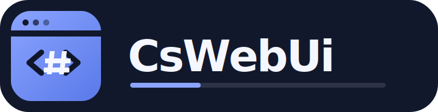

<p align="center">
  
</p>

# CsWebUi

Modern .NET 10 bindings for [WebUI](https://github.com/webui-dev/webui): use an installed browser or supported WebView as a lightweight cross-platform desktop UI.

`CsWebUi.Native` is a direct, unsafe C ABI layer for WebUI 2.5.0-beta.4. `CsWebUi` adds deterministic window ownership, UTF-8 conversion, error handling, raw-data helpers, and safe synchronous or `ValueTask`-based callbacks.

> This project follows WebUI's 2.5 beta ABI and is itself released as a prerelease package.

## Use it

```bash
dotnet add package CsWebUi --prerelease
```

```csharp
using CsWebUi;

using var window = new WebUiWindow();

window.Bind("multiply", static e =>
    WebUiResult.FromInt64(e.GetInt64() * e.GetInt64(1)));

window.BindAsync("greet", static (e, cancellationToken) =>
{
    cancellationToken.ThrowIfCancellationRequested();
    return ValueTask.FromResult<WebUiResult>($"Hello, {e.GetString()}!");
});

window.Show("""
    <!doctype html>
    <script src="webui.js"></script>
    <button onclick="multiply(6, 7).then(alert)">Multiply</button>
    <button onclick="greet('WebUI').then(alert)">Greet</button>
    """);

WebUiApplication.Wait();
```

`WebUiWindow.Dispose()` destroys the native window and safely defers final destruction until active managed callbacks finish. Async bindings automatically opt WebUI into its asynchronous-response mode; return a `WebUiResult` to resolve the JavaScript promise.

## Packages

| Package | Purpose |
| --- | --- |
| `CsWebUi.Native` | Full low-level C ABI, `LibraryImport`, pointers, native enums, callbacks, and library override support. |
| `CsWebUi` | Friendly window, event, callback, JavaScript, browser/server, and lifecycle APIs. |

Release packages bundle the standard, non-TLS WebUI shared library for `win-x64`, `linux-x64`, `linux-arm64`, `osx-x64`, and `osx-arm64`. The raw TLS API remains available when an application supplies a secure custom WebUI build.

The bundled Windows shared library statically links the MSVC runtime, matching the official WebUI Windows distribution and avoiding a separate Visual C++ Redistributable prerequisite.

### Optional Windows NativeAOT static linking

Windows `win-x64` NativeAOT applications can opt into linking WebUI and the
WebView2 loader directly into the application executable:

```xml
<PropertyGroup>
  <PublishAot>true</PublishAot>
  <RuntimeIdentifier>win-x64</RuntimeIdentifier>
  <CsWebUiStaticLink>true</CsWebUiStaticLink>
</PropertyGroup>
```

Publish normally with `dotnet publish`. The resulting publish directory does
not need `webui-2.dll` or `WebView2Loader.dll`. The Microsoft Edge WebView2
Runtime itself remains a system prerequisite when embedded WebView mode is
used.

Static linking is opt-in and currently supports only `win-x64`. Without
`CsWebUiStaticLink`, the package retains its normal dynamic-library behavior.
`WebUiNativeLibrary.SetLibraryPath` and `CSWEBUI_NATIVE_LIBRARY` are bypassed
in static mode because NativeAOT resolves the WebUI entry points at link time.
The WebView2 loader redistribution terms are included in the package under
`licenses/WebView2`.

For a custom or locally built native library, configure it before the first WebUI call:

```csharp
CsWebUi.Native.WebUiNativeLibrary.SetLibraryPath("/path/to/libwebui-2.so");
```

Alternatively set `CSWEBUI_NATIVE_LIBRARY` to a library file or its containing directory.

## NixOS development

The flake pins both Nixpkgs and the upstream WebUI source revision. It builds `webui-2`, exposes it through `CSWEBUI_NATIVE_LIBRARY`, and includes .NET 10, CMake, Chromium, Xvfb, and Linux WebView dependencies.

```bash
nix develop
dotnet test
dotnet run --project samples/CsWebUi.BasicSample
```

Useful flake outputs:

```bash
nix build .#webui-native
nix flake check
```

## Samples

- `CsWebUi.BasicSample` is the smallest possible callback example.
- [`CsWebUi.HighLevelSample`](samples/CsWebUi.HighLevelSample) is a complete local web application showcasing the safe window, event, async callback, binary-message, and JavaScript APIs.

## Design notes

- The raw package uses explicit Cdecl `LibraryImport` declarations, `nuint` for `size_t`, one-byte C booleans, and unmanaged function pointers.
- Both packages are trimming- and NativeAOT-oriented. The high-level callback dispatcher has no reflection-based registration.
- The high-level API parses JavaScript numeric arguments and serializes double results with the invariant culture, avoiding process-locale differences in WebUI's raw float helpers.
- Empty high-level callback results complete correctly when async bindings are present; WebUI's direct empty-string helper otherwise leaves that response pending.
- Strings passed to WebUI reject embedded null characters instead of silently truncating at the native C-string boundary.
- WebUI owns pointers returned from event accessors and other borrowed APIs. The safe `WebUiEvent` wrapper invalidates access after the callback completes.
- Browser mode needs an installed browser. Embedded WebView mode has platform dependencies, including the WebView2 runtime/loader on Windows and GTK/WebKit on Linux.

## License

CsWebUi is MIT licensed. WebUI is also MIT licensed; its attribution is retained in [NOTICE](NOTICE).
